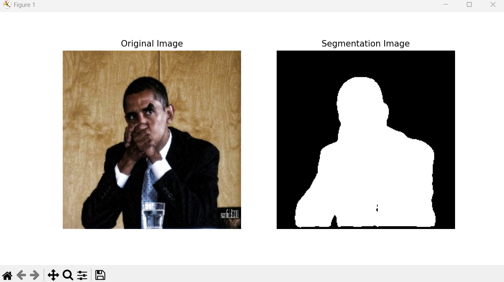
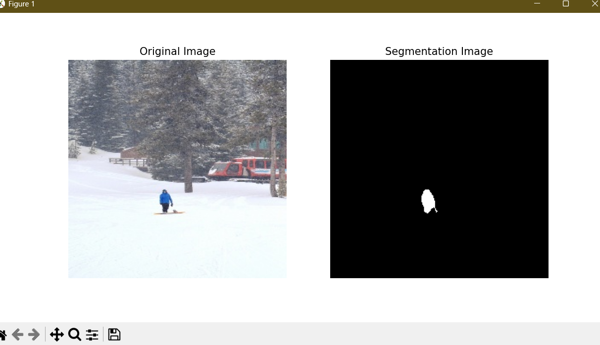

# PixelCut — AI Background Removal & Passport Photo Tool

Semantic image segmentation web app powered by a custom-trained U-Net model. Upload any photo with a person, swap the background to any color, or generate a passport-ready photo instantly.

## Features
- U-Net trained on COCO dataset for person segmentation
- Background removal and color replacement
- Passport photo generation (blue/white background, standard dimensions)
- REST API built with FastAPI
- React + TypeScript frontend (coming soon)
- GPU-accelerated inference with PyTorch + CUDA

## Technologies
- Python, PyTorch, OpenCV, NumPy
- FastAPI, Uvicorn
- segmentation-models-pytorch
- React, TypeScript, Vite (frontend)
- COCO 2017 Dataset

## Project Structure
```bash
coco-unet-segmentation/
│
├── ml/                        # Model training and data pipeline
│   ├── data/
│   │   ├── train2017/
│   │   ├── annotations/
│   │   ├── processed_images/
│   │   └── processed_masks/
│   ├── assets/
│   ├── train.py
│   ├── predict.py
│   ├── prepare_dataset.py
│   ├── unet_model.pth
│   └── requirements.txt
│
├── backend/                   # FastAPI inference server
│   ├── main.py
│   ├── inference.py
│   └── requirements.txt
│
└── frontend/                  # React + TypeScript UI (coming soon)
```

## Results
### Background Removal



## Setup & Running

### ML — Dataset & Training
Download from [COCO dataset](https://cocodataset.org):
- `train2017.zip`
- `annotations_trainval2017.zip`

Place inside `ml/data/` then run:

```bash
cd ml
pip install -r requirements.txt
python prepare_dataset.py
python train.py
```

### Backend — FastAPI Server
```bash
cd backend
python -m venv venv
source venv/Scripts/activate   # Windows Git Bash
pip install fastapi uvicorn python-multipart opencv-python torch torchvision segmentation-models-pytorch pillow
uvicorn main:app --reload
```

API will be live at `http://127.0.0.1:8000`
Interactive docs at `http://127.0.0.1:8000/docs`

### API Endpoints
| Method | Endpoint | Description |
|--------|----------|-------------|
| POST | `/remove-background` | Remove and replace background with a color |

**Parameters:**
- `file` — image file (jpg/png)
- `bg_color` — hex color string (default: `#ffffff`)
